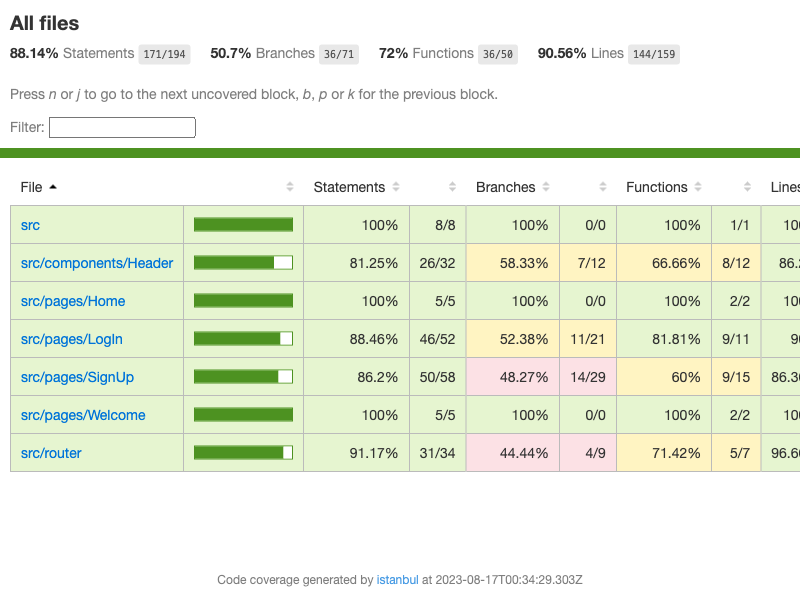

# Rent App

## Enviroment Variables

Before starting the project make sure to create an .env file with the corresponding variables from .env-example

## Reqres Users

In order to use the mock authentication you should use the following list of users provided by reqres.in
https://reqres.in/

### Login

- Username: eve.holt@reqres.in
- Password: cityslicka

### Register

- Username: eve.holt@reqres.in
- Password: any password
- Confirm Password: same password as before

important: any other email will make a failed login or register, this is up to reqres to change.

- Avatar profile image works as a button to go to auth home

## Available Scripts

In the project directory, you can run:

### `yarn start`

Runs the app in the development mode.\
Open [http://localhost:3000](http://localhost:3000) to view it in the browser.

The page will reload if you make edits.\
You will also see any lint errors in the console.

### `yarn test`

### `yarn test:watch`

Launches the test runner in the interactive watch mode.\
See the section about [running tests](https://facebook.github.io/create-react-app/docs/running-tests) for more information.

### `yarn build`

Builds the app for production to the `build` folder.\
It correctly bundles React in production mode and optimizes the build for the best performance.

The build is minified and the filenames include the hashes.\
Your app is ready to be deployed!

See the section about [deployment](https://facebook.github.io/create-react-app/docs/deployment) for more information.

## Features

- Log In at /login
- Home with authentication (List)

## Test Coverage > 80%

The following image gets updated automatically on every push to this branch, which means the coverage is up to date.

